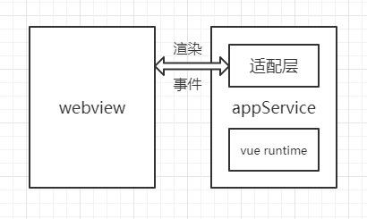
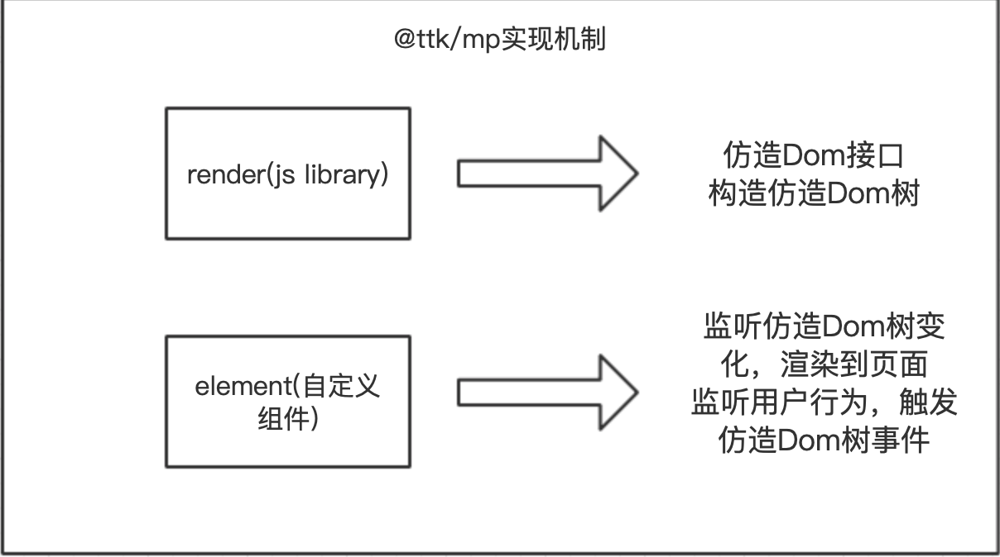

## 微信小程序多端框架@ttk/mp

### 适用场景

一个致力于微信小程序和 Web 端同构的解决方案。

微信小程序的底层模型和 Web 端不同，我们想直接把 Web 端的代码挪到小程序环境内执行是不可能的。@ttk/mp就是为了解决这个问题，它实现了一个适配器，在适配层里模拟出了浏览器环境，让 Web 端的代码可以不做什么改动便可运行在小程序里。这样，我们就可以借助 @ttk/mp 快速实现 Web 项目转化为微信小程序项目。

### 方案实现

方案设计有如下几个前提：

- 为了更好的复用组件，尽可能完整的支持 Web 端的特性
- 在小程序端的渲染结果要尽可能接近 Web 端 h5 页面

所以，与其他同构框架不同，@ttk/mp 是以适配器的方式来支持的。

适配器包含两部分：负责提供 dom/bom api 的 js 库和负责渲染的自定义组件，也就是 @ttk/mp 中的 miniprogram-render 和 miniprogram-element，可以看到 @ttk/mp 最终生成的小程序代码里会依赖这两个 npm 包。除此之外还需要一个 webpack 插件来根据原始的 Web 端源码生成小程序代码，因为小程序代码包和 Web 端的代码不同，它有固定的结构，而这个插件就是 mp-webpack-plugin。

**miniprogram-render、miniprogram-element 和 mp-webpack-plugin 这三个包即是 @ttk/mp 的核心**。

``

### **框架优势**

因为 @ttk/mp 是通过提供适配器的方式来实现同构，所以它的优势很明显：

1. 大部分流行的前端框架都能够在 @ttk/mp 上运行，比如 Vue、React、Preact 等。
2. 支持更为完整的前端框架特性，因为 @ttk/mp 不会对框架底层进行删改（比如 Vue 中的 v-html 指令、Vue-router 插件）。
3. 提供了常用的 dom/bom 接口，让用户代码无需做太大改动便可从 Web 端迁移到小程序端。
4. 在小程序端运行时，仍然可以使用小程序本身的特性（比如像 live-player 内置组件、分包功能）。
5. 提供了一些 Dom 扩展接口，让一些无法完美兼容到小程序端的接口也有替代使用方案（比如 getComputedStyle 接口）。

@ttk/mp 是使用一定的性能损耗来换取更为全面的 Web 端特性支持。